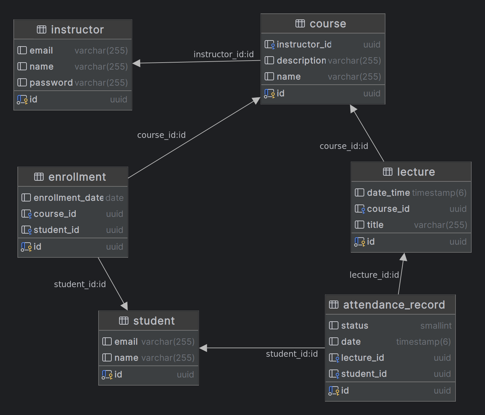

# <u>Student Attendance Management Backend System</u>

## <u>Running the application</u>
### Open the terminal:
* **Run PostgreSQL container using Docker**:\
`$ docker run --name attendace_database -e POSTGRES_USER=myuser -e POSTGRES_PASSWORD=mypassword -e POSTGRES_DB=attendance_db -d -p 5432:5432 postgres
`
* **Run the test first using Maven:** `$ ./mvnw test`
* **Then run the application server:** `$ ./mvnw spring-boot:run` 
## <u>Technologies and Tools:</u>
* **Java**
* **Spring Web**: for creating RESTful API controllers.
* **Spring Data JPA**: using Hibernate ORM for Entity mapping and facilitating database access.
* **PostgreSQL database**: for storing our data.
* **Spring Boot Test**: for testing our components using JUnit and Mockito.
* **Lombok**: to reduce boilerplate code in our Entities(.e.g getters and setters).
* **Docker**: for easily running our PostgreSQL database in a container.
* **Maven**: for managing our project libraries dependencies.
* **Git/GitHub**: to commit code changes to a repository.
* **Postman**: for testing our API endpoints.
## <u>Database ERD Diagram</u>
